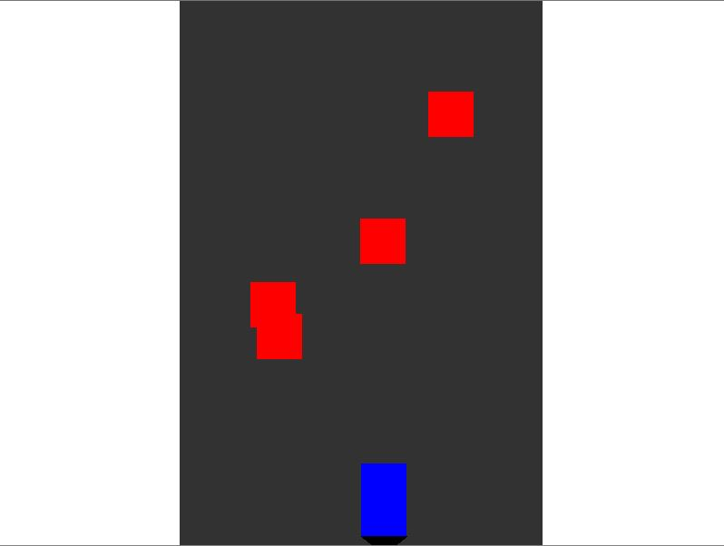

# Crossy Road Clone

This is a simple "Crossy Road" clone implemented using the LÖVE framework (Love2D). The game involves controlling a player character who must avoid cars while crossing multiple lanes of traffic.

## Gameplay

- **Objective**: The goal is to cross the road without getting hit by the cars. The player earns points by successfully crossing lanes, and the game becomes more challenging as the speed of the cars increases.

- **Controls**:
  - Arrow Keys: Move the player character (Up, Down, Left, Right).
  - Space: Start the game from the menu or restart the game after a game over.
  - P: Pause/Unpause the game.

- **Power-ups**: Occasionally, a power-up (represented as a yellow circle) will appear. Collecting it will grant the player an extra life.

## Installation and Running

1. **Install LÖVE**: Download and install LÖVE (Love2D) from [love2d.org](https://love2d.org/).

2. **Running the Game**:
   - Place the provided Lua files in a folder.
   - Drag the folder onto the LÖVE executable, or run it via the command line:
     ```
     love <path_to_folder>
     ```

